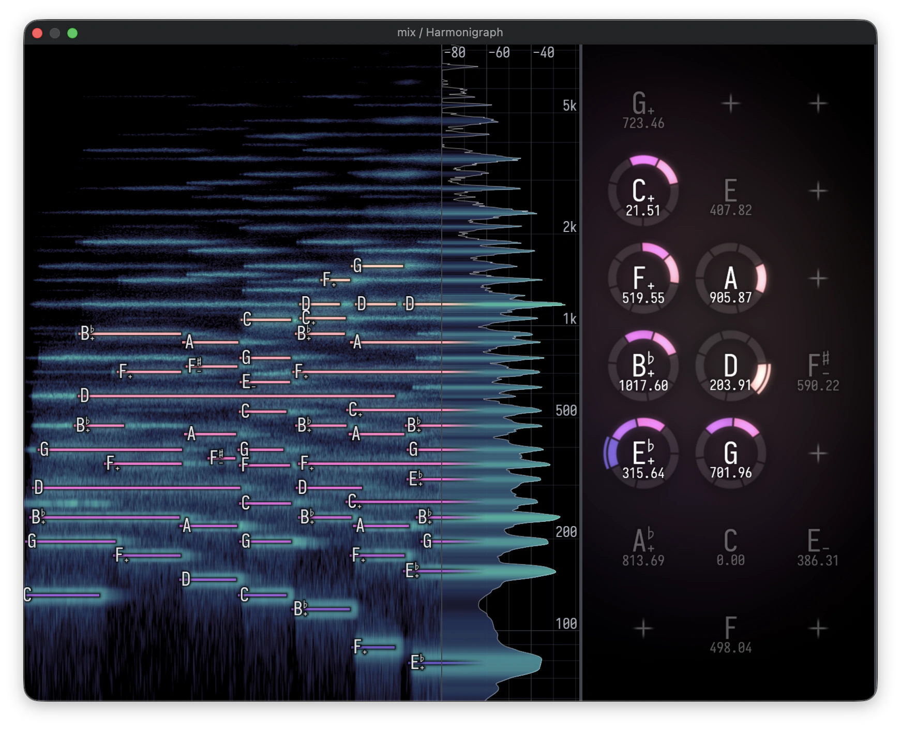

# Harmonigraph

Harmonigraph is the harmony visualizer I use while composing microtonal music,
and to turn my pieces into videos.
It runs as a CLAP or VST3 audio plugin.

This is an LLM-written project I direct and review for my personal needs.
Expect rough edges and breaking changes.
I have tested it only on macOS with Bitwig Studio.



[Video example.](https://www.youtube.com/watch?v=h66tTufp8bw)

## Features

- **Lattice.** Incoming MIDI notes are organized by pitch class and register on a tunable [Tonnetz](https://en.wikipedia.org/wiki/Tonnetz), making interval shapes and harmonic distance visible while I compose.
- **Spectrogram.** A live spectrum analyzer and scrolling spectrogram with overlaid piano roll.
- **Configuration.** Camera, lattice detail, frequency range, colors, lighting, pane visibility and layout.
- **Video.** Records performance data and audio for [offline rendering](docs/offline-rendering.md) at any resolution, frame rate or layout.
- **Adaptive tuning (experimental, CLAP only).** A separate [Tune note effect](docs/adaptive-tuning.md) adjusts new notes from harmonic context shared by a Harmonigraph Hub.

See the [settings guide](docs/settings.md) for controls and units.

## Try it from source

Install Rust with [rustup](https://rustup.rs/) and clone the repository,
then install `sccache`,
which the workspace requires as its compiler wrapper:

```sh
git clone https://github.com/yan-h/harmonigraph.git
cd harmonigraph
brew install sccache
```

The quickest way to see the full interface is the standalone harness.
It needs no DAW and starts with a mock progression;
it can also listen to a connected MIDI port:

```sh
cargo run -p harmonigraph-standalone
```

For Bitwig,
create the bundle structure once from the main checkout:

```sh
cargo xtask bundle harmonigraph-plugin --release
```

Add `<checkout>/target/bundled/` under **Settings → Locations → Plug-in Locations** in Bitwig.
After that,
`./update-plugin.sh` builds the current checkout and loads its CLAP/VST3 plugin plus matching offline renderer.
After installing,
deactivate and reactivate Bitwig's audio engine.

Install `ffmpeg` with `brew install ffmpeg` when you want encoded video rather than a frame sequence.
See [developing Harmonigraph](docs/development.md) for test commands,
worktree-safe build loading,
architecture and dependency notes.

## Guides

- [Settings](docs/settings.md)
- [Making a video without recording the screen](docs/offline-rendering.md)
- [Adaptive tuning](docs/adaptive-tuning.md)
- [Development and architecture](docs/development.md)
- [README philosophy and media placement](docs/readme-philosophy.md)

## License

Copyright (C) 2026 Yan Han.

Harmonigraph is licensed under the [GNU General Public License v3.0 or later](LICENSE).
It comes without warranty;
see the license for the full terms.

The reusable [`harmonigraph-core`](crates/harmonigraph-core) and [`harmonigraph-analysis`](crates/harmonigraph-analysis) crates are instead licensed under `MIT OR Apache-2.0`.
The vendored forks under [`vendor/`](vendor) retain their upstream terms:
`baseview`, `egui-baseview` and `wgpu-hal` are `MIT OR Apache-2.0`,
while `nice-plug` is ISC.
Each keeps its own license files;
[`PATCHES.md`](PATCHES.md) records the local changes.

VST is a trademark of Steinberg Media Technologies GmbH.
