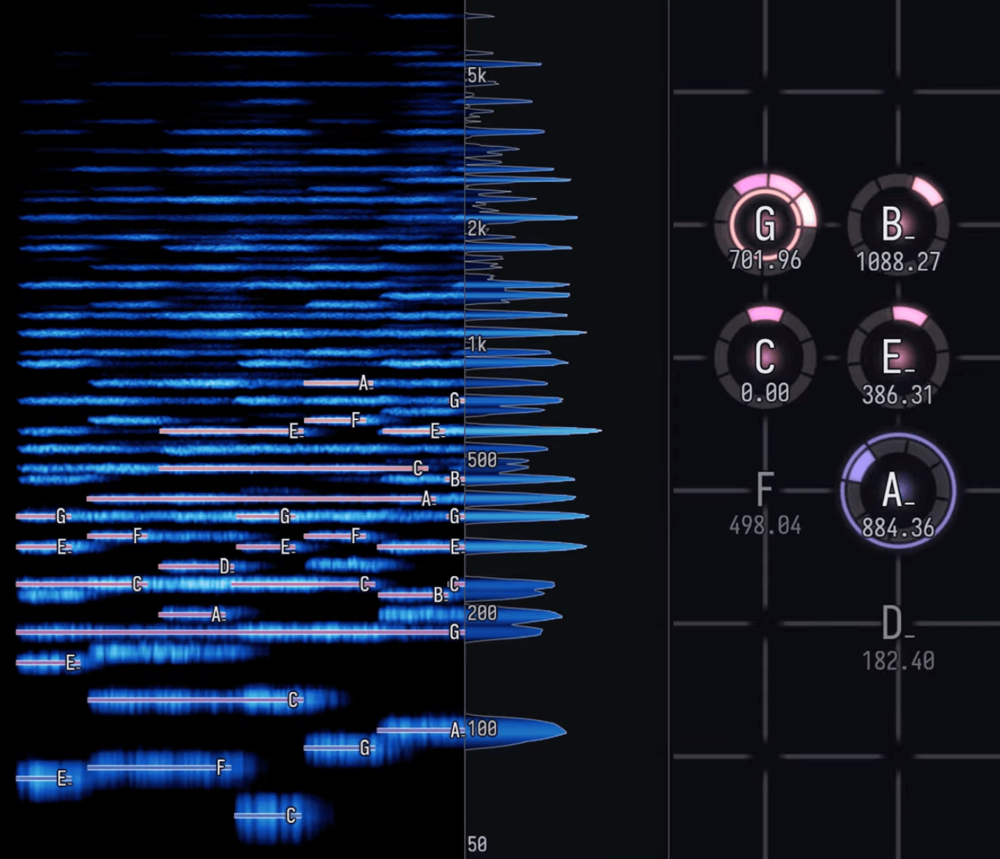

# Harmonigraph



A harmony visualizer that runs as an audio plugin (CLAP + VST3). I use it for checking my tuning when composing in my DAW, and for generating visualizations of my pieces.

The plugin draws incoming MIDI on a 3-dimensional [Tonnetz](https://en.wikipedia.org/wiki/Tonnetz).

- That is, a lattice with three directions: a perfect fifth, a major third, and a harmonic seventh.
- Each lattice node represents a pitch class. Pitch height of individual voices is represented by circular "slices".
- Each axis has its own tuning, so the lattice can be just, equal-tempered, or anywhere between.

It also includes a spectrum analyzer for incoming audio, which feeds a spectrogram overlayed with incoming MIDI.

Demonstration: [slipstream (5-limit just intonation)](https://www.youtube.com/watch?v=VuD9JOmi6_o).

Successor to [midi_lattice](https://github.com/yan-h/midi_lattice).

Almost every line here was written by Claude Code sessions, directed and reviewed by one human. [`CLAUDE.md`](CLAUDE.md) is the house style they work under; `./ci.sh` is the gate every push clears.

Stack: Rust, [nice-plug](https://codeberg.org/RustAudio/nice-plug) (the community continuation of nih-plug), egui 0.35, wgpu 29 (egui-baseview's wgpu backend in the plugin, eframe's in the standalone harness).

**Tested only on macOS, in Bitwig Studio.** No other OS or host has been tried. Several [`vendor/`](vendor) patches are macOS-only too — `cfg`-gated, so elsewhere it still builds, just without those fixes ([`PATCHES.md`](PATCHES.md)).

## Setup

The Rust toolchain is pinned by `rust-toolchain.toml` (1.92). rustup installs it on the first build.

**`sccache` has to be on `PATH`, or nothing builds.** `.cargo/config.toml` sets `rustc-wrapper = "sccache"` for the whole workspace. Without it, every cargo command here dies with `could not execute process sccache`.

```sh
brew install sccache
```

Why it is there: every worktree keeps its own `target/`, so parallel branches never wait on a shared build lock. The cost is that each one would otherwise recompile all ~465 dependencies from scratch. sccache serves those from a single store, so only this repo's own crates recompile. To rule it out while debugging a build failure, run `RUSTC_WRAPPER="" cargo build ...`.

`ffmpeg` is only for video export, and only if you want a playable file rather than a frame sequence (`brew install ffmpeg`).

## Everyday commands

```sh
# The dev loop: the full UI + renderer in a plain window, with a mock chord
# progression or any connected MIDI port. No DAW needed.
cargo run -p harmonigraph-standalone

# The whole test suite; every crate carries tests.
cargo test

# The exact checks .github/workflows/ci.yml runs: clippy -D warnings, the
# tests, baseview's own tests, the rustdoc doc-link check, and the
# harmonigraph-core dependency guard. Actions is currently off, so this is
# the gate — don't wait on a check to appear on your PR.
./ci.sh

# Build the CLAP/VST3 bundles into target/bundled/.
cargo xtask bundle harmonigraph-plugin --release

# Read the plugin's live settings back out of a saved Bitwig project
# (--rust prints them as an impl Default body). CLOSE the plugin window
# and save the project first — the UI state is only written on window
# close. See the script header.
./read-plugin-state.py
```

To gate every `git push` on `./ci.sh` automatically, enable the tracked hook once per clone: `git config core.hooksPath .githooks` (skip a one-off push with `git push --no-verify`). With Actions off, this hook is what actually gates anything.

## Getting a build into the DAW

The DAW scans exactly one place: the **main checkout's** `target/bundled/`. Two things hide a branch build from it.

- Each worktree has its own `target/`. The DAW never looks there.
- `cargo xtask bundle` run from a worktree bundles the *main* sources, not the branch's. It walks up to the topmost `Cargo.toml`, which for a nested worktree is the main repo. The bundle looks fresh and holds none of your changes.

Two scripts sidestep both. Each copies the binary into the bundles the DAW loads, then re-signs it ad-hoc — Apple Silicon requires that. Deactivate and reactivate the plugin afterwards: the copy writes through the bundle's own inode, which is the only swap a running host can see, and a rescan does not reload a plugin that is already loaded.

```sh
# Build the current checkout — branch or main — and load it. One shot.
./update-plugin.sh

# Load a build that already exists, without building anything.
./load-plugin.sh              # menu of every worktree's build
./load-plugin.sh --list       # print the table, load nothing
./load-plugin.sh <branch>     # load that branch's build (substring ok)
```

The two differ in one way: `update-plugin.sh` builds, `load-plugin.sh` only copies. That split exists because the bundle slot is shared. With several branches in flight, each build stays in its own worktree. You then pick which one goes live, rather than having them overwrite each other.

## Architecture

Dependencies point strictly downward; the fun layers never touch plugin plumbing.

```
harmonigraph-core        pure logic, no dependencies at all. PitchClass
                         (integer microcents) and Tuning; lattice coordinates;
                         NoteTracker (what sounds now); NoteHistory/NoteRoll
                         (what was played, by pitch and by time); the FFT
                         spectrum analyzer and its spectrogram history; a
                         minimal WAV reader; audio<->MIDI onset alignment.
                         Unit-tested. One module per concern.
harmonigraph-scene       per-frame view model: derive_scene() turns
                         tracker+tuning into NodeInstances; orbit Camera;
                         envelopes; CPU picking. Split style/view/camera/
                         color/derive; see its crate doc.
harmonigraph-render      wgpu renderer as an egui paint callback: instanced
                         billboard nodes, WGSL in src/shaders/lattice.wgsl.
                         *** Skins/effects/shaders iterate here. ***
harmonigraph-ui          egui_dock pane shell: Lattice / Tuning / Display /
                         Console / Spectral / Notes / Video / System tabs under
                         src/panes/, where Display carries the Color & light,
                         View, Nodes, Labels, Grid and Analyzer settings as
                         collapsible sections rather than tabs. SharedState
                         (the lattice's hovered node), ParamBackend trait
                         abstracting "where params live".
harmonigraph-take        the recorded input to a visualization: note events and
                         parameter automation on the audio clock, plus the
                         settings a render is composed from. Linked into the
                         plugin, so no GUI stack: serde+ron and
                         harmonigraph-core. See docs/offline-rendering.md.
harmonigraph-record      writes a take while the transport rolls (lock-free
                         rings, transport-jump detection) and drives
                         harmonigraph-offline as a subprocess when one
                         finishes, following its stderr for the progress bar.
                         No plugin API, so it is testable on its own.
harmonigraph-offline     offline video renderer: replays a take headless at an
                         exact frame rate, any resolution, own pane layout,
                         frames piped to ffmpeg. No window, no DAW, no realtime.
harmonigraph-standalone  eframe dev harness: mock chord progression OR hardware
                         MIDI in (midir, with MPE bend decoding), plus a mock
                         synth feeding the spectrum analyzer.
harmonigraph-plugin      nice-plug shell: params, MIDI + audio → two rtrb ring
                         buffers, custom wgpu egui editor (editor.rs) with
                         host-native window resizing, CLAP/VST3 exports.
```

Data flow in the plugin: the audio thread converts host MIDI to `NoteEvent`s and pushes them into a lock-free ring buffer; the GUI thread drains it into the `NoteTracker`, derives a `Scene`, and paints it. Parameters flow the other way through `ParamBackend` (a `ParamSetter` in the plugin, plain values in the harness), so every pane runs unmodified in both shells.

## Working on visuals

- `harmonigraph-render/src/shaders/lattice.wgsl` — node look, glow, animation.
- `harmonigraph-scene` — colors, envelopes, layout, camera behavior.
- Run the standalone harness; it uses the identical render path. No DAW needed until you're testing host integration.

## Version coupling

`egui-baseview 0.3` pins egui 0.35 / egui-wgpu 0.35 / wgpu 29 / baseview 0.1; `eframe` and `egui_dock` must match the egui version. All of this is centralized in the workspace `Cargo.toml` — bump the whole cluster together. `vendor/baseview` and `vendor/egui-baseview` both carry local patches (see PATCHES.md).

## License

Copyright (C) 2026 Yan Han.

Harmonigraph is free software: you can redistribute it and/or modify it under the terms of the GNU General Public License as published by the Free Software Foundation, either version 3 of the License, or (at your option) any later version. See [`LICENSE`](LICENSE) for the full text.

This program is distributed in the hope that it will be useful, but WITHOUT ANY WARRANTY; without even the implied warranty of MERCHANTABILITY or FITNESS FOR A PARTICULAR PURPOSE. See the GNU General Public License for more details.

### Exceptions

[`crates/harmonigraph-core`](crates/harmonigraph-core) is **`MIT OR Apache-2.0`**, not GPL. It is the one general-purpose library here — dependency-free just-intonation math, Tonnetz coordinates, and note spelling — and much of that math descends from the permissively licensed [midi_lattice v1](https://github.com/yan-h/midi_lattice), so it stays permissive too. `ci.sh` enforces the property that justifies the split: the crate must remain dependency-free. See [its README](crates/harmonigraph-core/README.md).

The vendored forks under [`vendor/`](vendor) (`baseview`, `egui-baseview`) are likewise **not** covered by the GPL — they remain under their upstream `MIT OR Apache-2.0` terms, with their own license files in each directory. See [`PATCHES.md`](PATCHES.md) for what was changed and why.

VST is a trademark of Steinberg Media Technologies GmbH.
