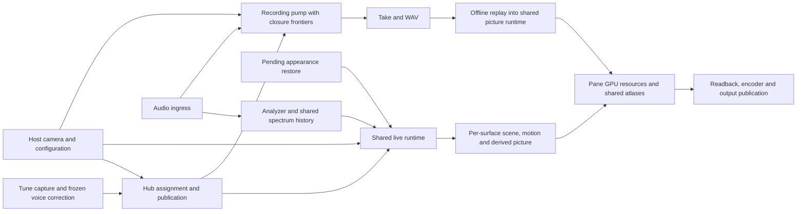

# Area map and ownership boundaries

The audit follows user workflows across crates rather than treating a crate boundary as proof of separation.
The pinned revision is ad1c6e6b9474dd80098703ae15cac241bba0eb41.
The 250-change history map guided attention; frequency of edits is a search aid, not evidence that an abstraction is needed.

| User area | Owners and crossing contracts | Audit leaves | Why this received depth |
| --- | --- | --- | --- |
| Play and retune notes | Tune captures, Hub policy/assignment, Session epoch, frozen per-voice correction | A1, A3, A6, A7 | Cross-instance reset can overlap collection; current lattice must describe actual sound |
| Read the audio spectrum | Plugin ingress, ChannelBank/Analyzer, AudioSpectrum display and history | A2, A4, A5 | #1407 removed redundant resources; reconfiguration, exact silence and energy calibration have different contracts |
| Change the look and save | Host camera parameters, editor shared state, pending restore and persisted blob | S1 | #1331/#1338 fixed stale save/restore; locks and fallback still affect freshness |
| Derive the current picture | Sanitized Scene.view, actual-pitch lookup, Fold/LUT keys | S2, A3 | #1421–#1424 recently removed duplicate normalization and range ownership |
| Draw lattice and labels | Shared atlas sheets; pane resources; encode-during-prepare lattice versus paint-later text | R1 | #1389 resize retention; later atlas mutation must not invalidate an already encoded draw |
| Draw spectral atmosphere | Aggregate transient Targets; separately retained tiles/history; Uniform split and Solo memory | R2, R3 | High change coupling and prior cache-key failures justify explicit shape/identity checks |
| Hide, reopen and resize | Shared live input/history, bounded hidden replay, per-surface motion/glow/GPU mirrors | S3, P1 | Different surfaces have different clocks and geometry; reuse must not merge those histories |
| Record through transport changes | Callback admission; producer/configuration/source closures; shared worker/FileWriter pump | T1 | #895/#1397 fixed divergence and late ordering; closing one owner does not close the others |
| Replay and export a take | Canonical event/parameter/configuration replay; captured appearance; FIFO jobs and exclusive publication | T2, T3, T4 | #1402/#1419 changed captured size and malformed-look behavior; pixels also depend on cadence |
| Develop and hand over | Per-worktree target, sccache, lifecycle lock/publication, CI gates and native patches | D1, D2 | Known build-tag/Linux issues and recent simplifications should not be rediscovered as new findings |

Separate ownership is retained where it carries independent time, lifetime or closure evidence.
The audit rejects a single global renderer cache, a merged recorder closure flag and another scene/settings schema unless a concrete future change removes the reason those boundaries exist.
See each investigation for the specific producer, consumer and fixture that support the scoped conclusion.
