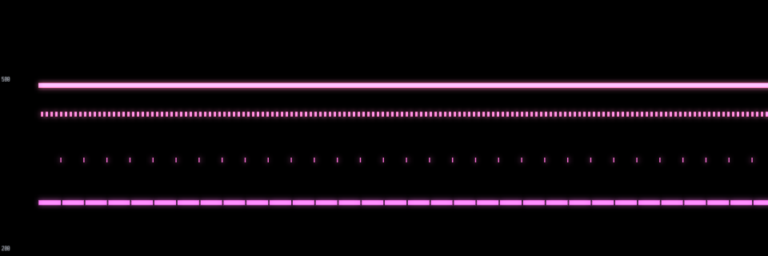
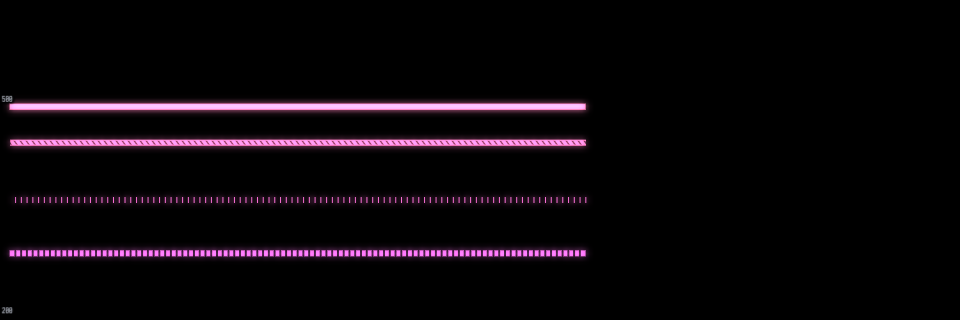
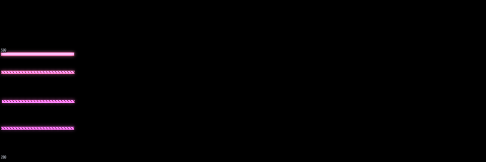

# Repeated-note readability

Actual offline-pipeline renders on Linux llvmpipe Vulkan, at one and two device pixels per logical point.
Each view shows the same twelve-second performance at a different history span.

From top to bottom:

- One sustained note, as the plain-fill reference.
- Notes every 25 ms, held for 12 ms, tuned up 0.3 semitones at onset.
- Notes every 120 ms, held for 6 ms.
- Notes every 120 ms, held for 119 ms.

At a four-second span, the visible repeats have gaps.
At twenty seconds, the fastest row becomes a continuous textured ribbon.
At eighty seconds, all three repeated-note rows are textured; the sustained note stays plain.
Evenly spaced inset diagonal marks denote a dense run, not its precise attack count.
The marks stay clearly visible through bloom; the solid edges remain continuous.







The corresponding 2x captures are [4 seconds](roll-density-4-2x.png), [20 seconds](roll-density-20-2x.png), and [80 seconds](roll-density-80-2x.png).

The permanent offline test renders all six cases and measures the cuts, continuous dense fill, texture contrast and plain sustained reference.
Regenerate the pictures with:

```sh
HARMONIGRAPH_REQUIRE_GPU=1 HARMONIGRAPH_ROLL_EVIDENCE=1 cargo test --locked \
  -p harmonigraph-offline \
  frames::tests::roll_density_retains_pixel_gaps_and_a_continuous_textured_body \
  -- --exact --nocapture
```

The pictures are written under `target/scratch/`.
This is rendering evidence and pixel-level coverage, not a native Bitwig listening or interaction check.
