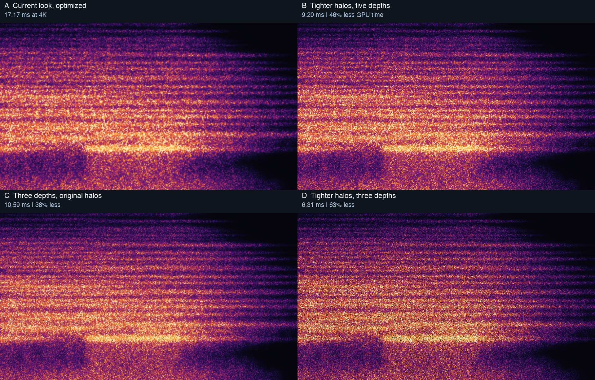

# Stars follow-up prototypes

These are experiments preserved for the next visual decision,
not additional changes enabled by PR #1167.
The [performance report](../../spectrogram-star-performance.md#picture-changing-candidates-measured-but-not-shipped) records their measurements,
geometry and tradeoffs.

Each patch applies independently to the optimized `spectrogram.wgsl` from PR #1167,
after row unrolling and reciprocal sigma were implemented.
Do not stack the patches:
D already includes B and C.

| ID | Shader patch | Additional 4K reduction | What changes |
|---|---|---:|---|
| A | No patch | — | Optimized current look, the reference |
| B | [two_by_two.patch](two_by_two.patch) | 46.4% | Four neighboring cells and tighter halos; keeps all five depths and star positions |
| C | [three_layers.patch](three_layers.patch) | 38.3% | Keeps layers 0, 2 and 4 with their original positions and speeds |
| D | [two_by_two_three.patch](two_by_two_three.patch) | 63.2% | Combines B and C; thinner and darker |
| E | [two_by_two_less_jitter.patch](two_by_two_less_jitter.patch) | 45.3% | Four neighbors with wider halos than B, bought by halving position jitter |

B is the first candidate to evaluate:
it retains all five depth layers and their irregular placement while removing halo work.
D offers a larger gain if the thinner field and fewer layers are acceptable.
E trades positional irregularity for a closer match to the current softness.
No option has been selected for implementation.

## Pictures and measurements



[2× detail of A–D](crop-2x.png) · [2× comparison of A and E](less-jitter-2x.png)

The stills are actual candidate WGSL renders at native 960×540,
over a light field derived by the look-prototype kit from 72–92 seconds of the real recording `take-2026-09-11_03-16-17.wav`.
They use the kit's palette,
and are not a replay of a saved Bitwig appearance.
The enlarged crops use nearest-neighbor scaling so the comparison adds no smoothing.
The original recording is not needed for the synthetic timing probe below.

[4K timing log](timings-4k.log) · [1080p timing log](timings-1080p.log)

These logs are the original interleaved runs,
120 measured frames after ten warmup frames on Apple M1 Pro with Metal.
Use the `end/full` interval,
not the obsolete `old med` bracket whose reversed timestamps the probe also records.
Savings compare each candidate with A in the same run,
and are additional to the approved loop/reciprocal optimization.
The 1080p run reverses case order.
All variants retain the five-layer star bake,
so these figures do not assume any future bake savings.
GPU times exclude the rest of the DAW.

## Trying one patch

Run from a clean,
owner-managed worktree containing the PR's optimized shader.
The patch check rejects source drift instead of silently substituting a different implementation.
For B:

```sh
git apply --check docs/evidence/spectrogram-stars/two_by_two.patch
git apply docs/evidence/spectrogram-stars/two_by_two.patch
HARMONIGRAPH_SHADER_ASSETS=source PROBE_CASE=stars PROBE_FRAMES=120 PROBE_FILLS=1 \
  cargo test --release -p harmonigraph-render cloud_costs_by_style_and_dial \
  -- --ignored --nocapture --test-threads=1
git apply -R docs/evidence/spectrogram-stars/two_by_two.patch
```

Set `PROBE_SIZE=1920x1080` for the smaller pane.
The existing probe runs one compiled shader at a time;
this recipe provides a fresh candidate measurement,
not an exact replay of the temporary interleaving instrumentation used for the retained logs.
Compare against the unpatched shader under similar load,
and rerun interleaved measurements before claiming a new speedup.
Use source mode for these experiments because the committed Metal corpus belongs to the shipping shader.

## Work remaining after a visual choice

These are the exact small source experiments used for the measurements,
not production-ready patches.
They intentionally retain existing comments and test assumptions that describe the current 3×3 walk.
Before shipping B,
D or E,
replace that geometry's documentation and the existing ring-reach regression with a fixture that reaches the selected nearest-2×2 boundary,
including drift and pane edges.
The 0.7-cell support for B and D,
or 0.85 for E,
is required to keep discarded stars at zero coverage;
merely dropping five reads from the original shader would cut visible halos at cell boundaries.

C and D draw only three existing layers while the CPU still lays out and bakes all five.
If reducing the atlas and bake work too,
update both CPU and shader indexing together and measure again;
the retained timings make no claim about that additional change.
Check silence,
life transitions,
parallax,
Fringe 0 and its maximum,
size and density extremes,
and exports at different resolutions.
Use a real recording and a flat field for the visual comparison,
including motion.
The owner chooses the new look before its default or controls change.
Then inspect and update the affected golden,
regenerate the Metal corpus on the runner,
and build both plugin and offline renderer.

Reduced-resolution RGB compositing is a separate,
unmeasured possibility.
It would need an RGB-capable target instead of the existing scalar tone target,
and would trade fine pinpoint sharpness for fewer output fragments.
There is no implementation or measured speedup for it in this evidence.
