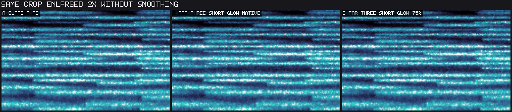
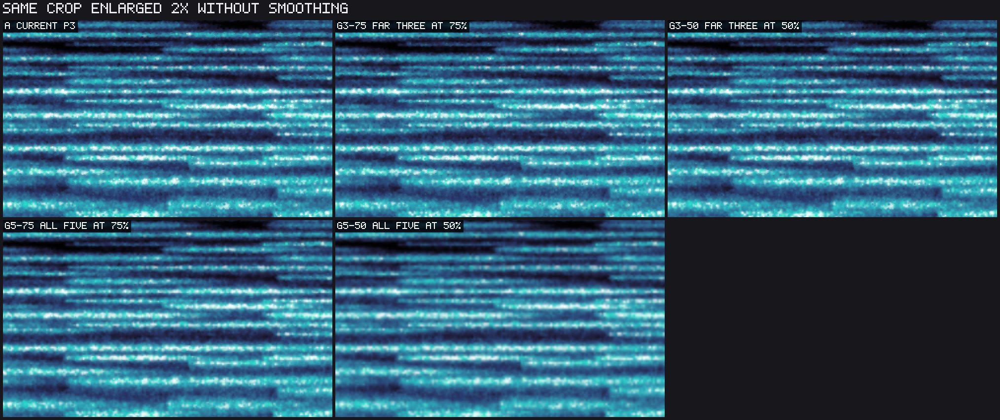

# Stars architecture trials

This is an experiment report against P3 at `7711b98d2c28c737b5a9c44dd298eb3d96efe589`, on Apple M1 Pro / Metal.
It preserves candidate implementations and measurements; it does not select or ship a new look.
The user's cost function is visual difference plus maintenance burden, rather than implementation time.

## Result and recommendation

There are still substantial performance gains worth considering.
The strongest new family keeps the nearest two depths unchanged and renders the farthest three together.
For the stated visual-plus-maintenance cost, the native-resolution short-glow group is the first candidate: it preserves sharpness and can reuse the native 3+2 tone architecture.
A 75%-dimension target is the faster alternative, at the cost of some distant softness and extra scaling/sampling logic.
Shortening only those distant halos allows four contributors per target pixel.
That combination is much closer to the current appearance in the inspected recorded-take stills than shortening all five layers or reducing the entire field's resolution.
The table below distinguishes screens from confirmations.
See [RESULTS.md](RESULTS.md) for every completed run and both paired statistics.
Visual acceptance remains the owner's decision; pixel-error figures are descriptive, not a perceptual threshold.

The appropriate production design would be one fixed policy with a shared star-response helper and one far-group target.
The research environment switches, duplicated shader files, masks and probe modules should not become permanent modes.
The group reuses the existing tone pass, but production work must own target sizing, sampling and edge coverage explicitly.

## Measured shortlist

All savings below are median paired GPU-time reductions against current P3, not against the in-progress 3+2 change.
Ranges span the completed default-take screen/confirmation runs named in RESULTS; evidence strength is stated per row.

| Candidate | 1080p saving | 4K saving | Evidence / visual cost |
|---|---:|---:|---|
| Far three, short glow, native dimensions | 26.1% | 16.9% | One balanced run; no downsampling, conservative glow change |
| Far three, short glow, 75% dimensions | 32.9–33.9% | 25.9–26.3% | Screen plus independent repeat and workload checks |
| Far three, short glow, 50% dimensions | 31.7% | 33.1–33.5% | Screen plus independent repeat; more distant softness |
| Far three, wide glow, 50% dimensions | 24.0–24.7% | 23.2–23.4% | Screens plus repeat/workload checks; distant cores softened |
| Wide glow only on nearest two (mask 24) | 13.6–14.6% | 9.5–9.6% | Two screens; small glow change, native sharpness |
| Four-neighbor residual halos everywhere | 24.0–26.1% | 25.0–25.2% | Two confirmation runs; noticeably less glow |
| Direct four-neighbor response everywhere | 21.8–26.0% | 19.6–19.7% | Two confirmation runs; noticeably less glow |
| All five, wide glow, 75% dimensions | 36.8–39.8% | 31.0–31.5% | Two confirmation runs; softer star detail |
| All five, wide glow, 50% dimensions | 53.0–55.1% | 56.5% | Two confirmation runs; clearly softer field |
| Skip impossible neighboring core work | 2.1–3.7% | 1.7–2.4% | Screen plus confirmation; byte-exact tested frames |
| Native complete-response helper | -0.4% | 2.9% | Confirmation matches prior size-dependent result |

The independent short75 repeat has paired mean savings of approximately 33% and 26%, with A/A mean differences 0.31% and 0.48%.
Native short100 saved 26.1% and 16.9% in that same balanced run.
It avoids the scaled target, bilinear upsampling and edge-padding machinery for roughly 6.8 and 9.0 percentage points less saving than short75.
These percentages are measured against P3; they do not establish gains on other GPUs or settings.
The 3+2 control saved 5.5% at 1080p and 1.5% at 4K in this initial screen; it is not additive with any row above.

The following views show the same instant and crop without smoothing:

## Completed focused confirmations

After the user supplied a quiet GPU window, `final_confirm.py` completed the independent repeat, synthetic/sparse workloads, live-pane size and same-look confirmation.

| Workload | Short75 at 1080p | Short75 at 4K | Wide50 at 1080p | Wide50 at 4K |
|---|---:|---:|---:|---:|
| Default take, independent repeat | 32.9% | 25.9% | 24.7% | 23.4% |
| Synthetic input | 31.7% | 26.6% | 24.1% | 24.0% |
| Sparse stars | 25.7% | 26.2% | 23.7% | 24.1% |

At 926x720 the short75 group saved approximately 20.9%, compared with 12.6% for wide50.
Sparse 1080p A/A was -2.05% and the live-pane A/A was -1.46%, so those results support the direction and rough magnitude rather than precise percentages.
Native short100 has the one default-take run and coverage/appearance evidence; the extra workload matrix was run for short75 and wide50.

The same-look confirmation found approximately 2.1%/2.4% for omitting impossible core work and -0.4%/2.9% for native complete response.
The 4K baseline drifted to about 30 ms in that run and A/A was 0.99%; the micro result is a small possible gain, not a reason for new pipeline machinery.
All runs and samples remain available, including the earlier explicitly excluded interrupted-window evidence.

## What was tried, in order

1. Four-neighbor complete response at native resolution (`direct4`) and four-neighbor residual halos with current native cores (`residual4`).
   Both retain five layers, star identity, jitter, color and lifetime behavior, but shorten glow support.
2. Fixed per-depth hybrids: retain wide halos on masks 1, 2, 3, 4, 8, 12, 16, 24 and 28; render remaining depths directly with the shortened support.
   Bit zero is the farthest layer; mask 24 retains wide glow on the nearest two.
3. Complete wide-glow groups: farthest three or all five at 75% and 50% of each target dimension.
4. Focused combination: farthest three with short glow at 75% and 50%, leaving the nearest two on P3.
   A native-resolution short-group variant was also measured to separate the partitioning benefit from downsampling.
5. Same-look arithmetic: screen and confirm omission of impossible neighboring core subtraction; repeat aligned native complete-response timing and image checks.
   The separate 3+2 implementation is included as a control, not claimed as new work.

Previous evidence already covers four layers, P2, split partitions, sprites, shared blur, within-cell clipping and temporal reuse limitations.
Those are not rediscovered or turned into speculative ports here.
See #1142, #1242 and the subsequent next-experiments report in #1244.

## Why four neighbors can work

The current P3 halo fractions are `[0.5, 0.5, 1, 1, 0.6]`.
Nine candidate neighbors across those targets cost `9 * (0.25 + 0.25 + 1 + 1 + 0.36) = 25.74` halo evaluations per native output pixel, plus five native core evaluations.
These are candidate evaluations, not a claim that 26 visible halos overlap every pixel.
Candidates can be empty or rejected by distance.

The four-cell gather has guaranteed coverage only when radial support is at most `1 - jitter_span / 2` cell widths.
At the current default jitter dial, the actual jitter span is 0.3, so support is 0.85 cells; at full jitter it is 0.7.
The short variants fade over the final 0.15 cells and preserve jitter itself.
The current long support is 1.2 cells.
Thus reduced glow, rather than reduced jitter, buys the smaller gather in these trials.

`direct4` removes all halo draws and allocations and evaluates 20 contributors per native pixel.
`residual4` keeps existing P3 targets and native cores, evaluating approximately 16.44 candidates per native pixel.
Counts explain direction, not runtime: shader work, occupancy, target traffic and compositing also matter.
The different render resolutions mean those two variants do not produce identical images, even though their analytic support is the same.

## Timing method and limits

All variants in a run use one release binary, source-compiled shaders, independently allocated resources and the production source-BEGIN to dependent-composite-END GPU bracket.
This includes the relevant source, relay, blur, atlas, halo and composite work, not the entire DAW or display frame.
Savings are GPU-time reductions, not claimed whole-plugin FPS gains.
Only Apple M1 Pro / Metal was measured.

Each run starts with 120 warmup rounds.
A/A shaders are byte-identical.
Every frame measures all candidates against the mean of its two controls.
Runs use all permutations for up to four cases and balanced forward/reverse rotations otherwise.
The reported primary statistic is median paired percentage saving; raw samples, mean paired percentages and A/A differences are retained.
No outliers are selectively deleted.
The initial `screen1` attempt failed before measurement because the source override omitted the shared geometry helper; `screen1-fixed` corrected concatenation and is the first usable screen.
The failed setup log and obsolete source hashes are retained for provenance, not included as results.
The display has 39.149967 seconds of history; 1080p is 2 px/point and 4K is 4 px/point, preserving logical pane size.
The 720-line test uses the prior live-pane geometry, 926x720 at 1 px/point.

The take timing fixture reconstructs 20 seconds of recorded levels and cycles 960 slabs through a live-sized ring.
It is not the exact plugin analyzer mapping.
The synthetic all-layer run completed at 1080p; its 4K run was disturbed.
The focused short75/wide50 confirmations subsequently completed on synthetic, sparse (density 1 instead of the default 10) and live-pane inputs in the quiet window.
The initial `screen1-fixed`, `screen2-*` and `screen3-groups` runs inherited a 1/48-second clock step while shifting one displayed slab.
`screen4-combinations`, all `confirm-*` and `focused-*`, and `same-look-final` use the corrected `history_seconds / 960` step for the take.
Both candidates and controls shared the earlier step, so those runs remain screens, not the final confirmation basis.

The first `confirm-main-synthetic` 4K run overlapped competing graphics activity and severe stalls.
Its A/A mean difference was -17.59%; it is retained but excluded from conclusions.
The following sparse run was interrupted.
This exclusion is at run level and has an observed environmental cause.
The user then supplied a quiet window and all focused confirmations completed.
The preserved research binary was reused after the evidence-only commit; run manifests record that checkout HEAD while the binary hash identifies the unchanged experiment executable.
See `interruption.md` for the restart record.

## Appearance and coverage checks

Actual appearance captures run the offline renderer on the owner's take from 46.766945 to 92.766945 seconds, at 768x432 and 24 fps.
They discard a full 40-second lead-in and retain the final 144 frames.
The appearance file and hashes are preserved.
The current renderer A/A movie arrays were byte-identical across all 144 frames, including captures made after the scratch host rebuild.
PNG stills and metrics use lossless arrays; MP4s are viewing copies.
The subsequently captured native short100 movie differs from the mask-24 movie by at most one code value across all 144 frames (mean RGB error 0.002/255).
Against P3, the inspected-pane movie mean error is 0.356/255 for native short100 and 0.437/255 for short75; localized maximum differences are 132 and 112 respectively.
Those averages do not certify visual equivalence, and the fractional-origin still fixture reverses their numerical closeness ranking.
Native short100 leads on simpler geometry and retained sharpness, not on a universal pixel-error claim.
No audio or original take is included in this evidence package.

Inspection included native stills, identical crops enlarged without smoothing, and flat-input controls.
The full-field half-resolution version visibly softens star detail.
The selective far-group versions retain the foreground grain and most of the glow much more closely.
The local synchronized movies allow the owner to judge movement and softness; still inspection does not certify temporal equivalence.

Coverage probes compare the four-cell short gather against an independent nine-cell gather with the same short support.
They agree exactly or within one 8-bit code value at default jitter, full jitter, fractional scale and 4K scale.
The refactored long response and the impossible-core omission are byte-exact against their respective controls in the tested frames.
Native complete-response and native grouped controls differ by at most one code value in the tested cases.
These rounding checks do not imply reduced-resolution visual equivalence.

The first shifted-pane fixture was invalid: it moved the callback rectangle without moving relay vertices or applying the final pane scissor.
Its large outside-pane differences are retained as a rejected fixture result.
After fixing the fixture, the 1.25 px/point, 7.3-point-origin native group check is within one code value.
Reduced-target sampling also pads the source scissor by one texel to define bilinear edge taps.
A production port still owes normal pane/layout regression coverage and regenerated Metal assets.

## Engineering ranking

- Far-three short group at native resolution: first candidate for the stated visual-plus-maintenance cost.
  It retains native grain, changes only distant glow, and can reuse the existing native tone target without new resolution handling.
- Far-three short group at 75%: the faster alternative for a small deliberate look change.
  It combines fewer halo contributors with less distant-layer work while retaining the nearest layers.
- Far-three wide group at 50%: useful alternative if preserving broad distant glow matters more than distant sharpness.
- Mask-24 hybrid: a useful shape reference, but the native far-three group is faster with the same short-support construction.
  Their fractional-origin take/flat probes differ by at most one 8-bit code value.
- Four-neighbor residual everywhere: comparatively small implementation delta and useful savings, but appreciably less glow across all depths.
- Direct four-neighbor everywhere: simpler rendering lifecycle and fewer resources, but a larger visual change and slower than residual4 at 4K here.
- Whole-field reduced resolution: largest gain, with obvious softness; only attractive if that new look is desirable.
- Individual retained-halo masks: screened, but most offer a weaker visual/performance/maintenance tradeoff than a single fixed far-three group.
- Micro arithmetic and native complete response: judge against A/A and repeated runs; small effects do not justify a separate architecture.

No gains here should be added arithmetically to the separate 3+2 work.
A selected production port must be measured against the then-current baseline.

## Higher-resolution follow-up

The owner found the 75% variant visually similar and requested a higher-resolution video comparison.
A fresh 4K capture pair and native-pixel crop comparison are documented in [high-resolution/README.md](high-resolution/README.md).
This follow-up keeps the same take interval and 40-second warmup, using standard 4K export density.
It adds visual evidence, not another timing claim or a production selection.
