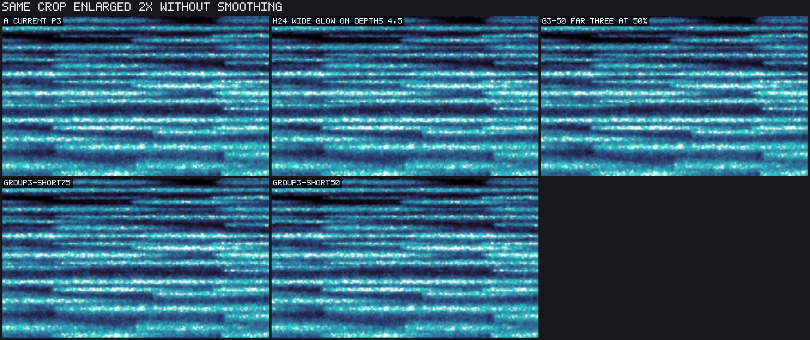

# Stars architecture trials

This is an experiment report against P3 at `7711b98d2c28c737b5a9c44dd298eb3d96efe589`, on Apple M1 Pro / Metal.
It preserves candidate implementations and measurements; it does not select or ship a new look.
The user's cost function is visual difference plus maintenance burden, rather than implementation time.

## Result and recommendation

There are still substantial performance gains worth considering.
The strongest new family keeps the nearest two depths unchanged and renders the farthest three together in a reduced-resolution color target.
Shortening only those distant halos allows four contributors per target pixel.
That combination is much closer to the current appearance in the inspected recorded-take stills than shortening all five layers or reducing the entire field's resolution.
The table below distinguishes screens from confirmations.
See [RESULTS.md](RESULTS.md) for every completed run and both paired statistics.
Visual acceptance remains the owner's decision; pixel-error figures are descriptive, not a perceptual threshold.

The appropriate production design would be one fixed policy with a shared star-response helper and one far-group target.
The research environment switches, duplicated shader files, masks and probe modules should not become permanent modes.
The group reuses the existing tone pass, but production work must own target sizing, sampling and edge coverage explicitly.

## Measured shortlist

All savings below are median paired GPU-time reductions against current P3, not against the in-progress 3+2 change.
Ranges are the two completed default-take confirmation runs; single numbers are screens.

| Candidate | 1080p saving | 4K saving | Evidence / visual cost |
|---|---:|---:|---|
| Far three, short glow, 75% dimensions | 33.9% | 26.3% | One balanced screen; close in inspected stills |
| Far three, short glow, 50% dimensions | 31.7% | 33.1% | One balanced screen; more distant softness |
| Far three, wide glow, 50% dimensions | 24.0–24.3% | 23.2–23.4% | Two screens; broad glow retained, distant cores softened |
| Wide glow only on nearest two (mask 24) | 13.6–14.6% | 9.5–9.6% | Two screens; small glow change, native sharpness |
| Four-neighbor residual halos everywhere | 24.0–26.1% | 25.0–25.2% | Two confirmation runs; noticeably less glow |
| Direct four-neighbor response everywhere | 21.8–26.0% | 19.6–19.7% | Two confirmation runs; noticeably less glow |
| All five, wide glow, 75% dimensions | 36.8–39.8% | 31.0–31.5% | Two confirmation runs; softer star detail |
| All five, wide glow, 50% dimensions | 53.0–55.1% | 56.5% | Two confirmation runs; clearly softer field |
| Skip impossible neighboring core work | 3.7% | 1.7% | One screen; byte-exact probes, benefit not yet confirmed |

The far-three short 75% screen's paired means are 32.2% and 26.4%; A/A mean differences are -0.24% and -1.02%.
Its gain is much larger than the control mismatch, but it still needs the independent repeat and workload checks before a production performance claim.
The same-look complete-response helper retains its prior #1244 timing evidence, rather than a new timing result here.
The 3+2 control saved 5.5% at 1080p and 1.5% at 4K in this initial screen; it is not additive with any row above.

The following views show the same instant and crop without smoothing:

## Pending quiet-window checks

The queued `final_confirm.py` lists the remaining independent repeat, synthetic/sparse workloads, live-pane size and same-look confirmation.
It includes the generated `group3-short100` control, which has no measurement or appearance claim in this report.
The user was asked for a quiet GPU window after competing graphics activity began; no response had arrived while this draft was assembled.
These follow-ups are explicit unfinished verification, not failed candidates.
The tested families are preserved and comparable without shipping an unselected look.

## What was tried, in order

1. Four-neighbor complete response at native resolution (`direct4`) and four-neighbor residual halos with current native cores (`residual4`).
   Both retain five layers, star identity, jitter, color and lifetime behavior, but shorten glow support.
2. Fixed per-depth hybrids: retain wide halos on masks 1, 2, 3, 4, 8, 12, 16, 24 and 28; render remaining depths directly with the shortened support.
   Bit zero is the farthest layer; mask 24 retains wide glow on the nearest two.
3. Complete wide-glow groups: farthest three or all five at 75% and 50% of each target dimension.
4. Focused combination: farthest three with short glow at 75% and 50%, leaving the nearest two on P3.
   A native-resolution short-group variant was generated for follow-up, but not executed before the quiet-window pause.
5. Same-look arithmetic: screen omission of impossible neighboring core subtraction; replay aligned native complete-response image checks from prior timing evidence.
   The separate 3+2 implementation is included as a control, not claimed as new work.

Previous evidence already covers four layers, P2, split partitions, sprites, shared blur, within-cell clipping and temporal reuse limitations.
Those are not rediscovered or turned into speculative ports here.
See #1142, #1242 and the subsequent next-experiments report in #1244.

## Why four neighbors can work

The current P3 halo fractions are `[0.5, 0.5, 1, 1, 0.6]`.
Nine candidate neighbors across those targets cost `9 * (0.25 + 0.25 + 1 + 1 + 0.36) = 25.74` halo evaluations per native output pixel, plus five native core evaluations.
These are candidate evaluations, not a claim that 26 visible halos overlap every pixel.
Candidates can be empty or rejected by distance.

The four-cell gather has guaranteed coverage only when radial support is at most `1 - jitter_span / 2` cell widths.
At the current default jitter dial, the actual jitter span is 0.3, so support is 0.85 cells; at full jitter it is 0.7.
The short variants fade over the final 0.15 cells and preserve jitter itself.
The current long support is 1.2 cells.
Thus reduced glow, rather than reduced jitter, buys the smaller gather in these trials.

`direct4` removes all halo draws and allocations and evaluates 20 contributors per native pixel.
`residual4` keeps existing P3 targets and native cores, evaluating approximately 16.44 candidates per native pixel.
Counts explain direction, not runtime: shader work, occupancy, target traffic and compositing also matter.
The different render resolutions mean those two variants do not produce identical images, even though their analytic support is the same.

## Timing method and limits

All variants in a run use one release binary, source-compiled shaders, independently allocated resources and the production source-BEGIN to dependent-composite-END GPU bracket.
This includes the relevant source, relay, blur, atlas, halo and composite work, not the entire DAW or display frame.
Savings are GPU-time reductions, not claimed whole-plugin FPS gains.
Only Apple M1 Pro / Metal was measured.

Each run starts with 120 warmup rounds.
A/A shaders are byte-identical.
Every frame measures all candidates against the mean of its two controls.
Runs use all permutations for up to four cases and balanced forward/reverse rotations otherwise.
The reported primary statistic is median paired percentage saving; raw samples, mean paired percentages and A/A differences are retained.
No outliers are selectively deleted.
The initial `screen1` attempt failed before measurement because the source override omitted the shared geometry helper; `screen1-fixed` corrected concatenation and is the first usable screen.
The failed setup log and obsolete source hashes are retained for provenance, not included as results.
The display has 39.149967 seconds of history; 1080p is 2 px/point and 4K is 4 px/point, preserving logical pane size.
The queued 720-line test is configured for the prior live-pane geometry, 926x720 at 1 px/point.

The take timing fixture reconstructs 20 seconds of recorded levels and cycles 960 slabs through a live-sized ring.
It is not the exact plugin analyzer mapping.
The synthetic all-layer run completed at 1080p; its 4K run was disturbed.
Sparse, live-pane and focused-candidate confirmations remain pending, rather than inferred from the default screen.
The initial `screen1-fixed`, `screen2-*` and `screen3-groups` runs inherited a 1/48-second clock step while shifting one displayed slab.
`screen4-combinations` and all `confirm-*`, `focused-*` use the corrected `history_seconds / 960` step for the take.
Both candidates and controls shared the earlier step, so those runs remain screens, not the final confirmation basis.

The first `confirm-main-synthetic` 4K run overlapped competing graphics activity and severe stalls.
Its A/A mean difference was -17.59%; it is retained but excluded from conclusions.
The following sparse run was interrupted.
This exclusion is at run level and has an observed environmental cause.
See `interruption.md` for the restart record.

## Appearance and coverage checks

Actual appearance captures run the offline renderer on the owner's take from 46.766945 to 92.766945 seconds, at 768x432 and 24 fps.
They discard a full 40-second lead-in and retain the final 144 frames.
The appearance file and hashes are preserved.
The current renderer A/A movie arrays were byte-identical across all 144 frames, including captures made after the scratch host rebuild.
PNG stills and metrics use lossless arrays; MP4s are viewing copies.
No audio or original take is included in this evidence package.

Inspection included native stills, identical crops enlarged without smoothing, and flat-input controls.
The full-field half-resolution version visibly softens star detail.
The selective far-group versions retain the foreground grain and most of the glow much more closely.
The local synchronized movies allow the owner to judge movement and softness; still inspection does not certify temporal equivalence.

Coverage probes compare the four-cell short gather against an independent nine-cell gather with the same short support.
They agree exactly or within one 8-bit code value at default jitter, full jitter, fractional scale and 4K scale.
The refactored long response and the impossible-core omission are byte-exact against their respective controls in the tested frames.
Native complete-response and native grouped controls differ by at most one code value in the tested cases.
These rounding checks do not imply reduced-resolution visual equivalence.

The first shifted-pane fixture was invalid: it moved the callback rectangle without moving relay vertices or applying the final pane scissor.
Its large outside-pane differences are retained as a rejected fixture result.
After fixing the fixture, the 1.25 px/point, 7.3-point-origin native group check is within one code value.
Reduced-target sampling also pads the source scissor by one texel to define bilinear edge taps.
A production port still owes normal pane/layout regression coverage and regenerated Metal assets.

## Engineering ranking

- Far-three short group at 75%: strongest first candidate for a small deliberate look change.
  It combines fewer halo contributors with less distant-layer work while retaining the nearest layers.
- Far-three wide group at 50%: useful alternative if preserving broad distant glow matters more than distant sharpness.
- Mask-24 hybrid: a conservative alternative when downsampling is objectionable.
  A native far-three short group is a generated, unmeasured follow-up to isolate partitioning.
- Four-neighbor residual everywhere: comparatively small implementation delta and useful savings, but appreciably less glow across all depths.
- Direct four-neighbor everywhere: simpler rendering lifecycle and fewer resources, but a larger visual change and slower than residual4 at 4K here.
- Whole-field reduced resolution: largest gain, with obvious softness; only attractive if that new look is desirable.
- Individual retained-halo masks: screened, but most offer a weaker visual/performance/maintenance tradeoff than a single fixed far-three group.
- Micro arithmetic and native complete response: judge against A/A and repeated runs; small effects do not justify a separate architecture.

No gains here should be added arithmetically to the separate 3+2 work.
A selected production port must be measured against the then-current baseline.
