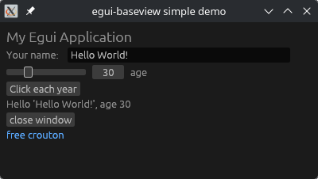

# egui-baseview

[](https://docs.rs/egui-baseview)
[](https://crates.io/crates/egui-baseview)
[](https://codeberg.org/RustAudio/iced_baseview/src/branch/main/LICENSE-APACHE)

A [baseview](https://github.com/RustAudio/baseview) backend for [egui](https://github.com/emilk/egui)

This is used by the [nice-plug](https://codeberg.org/RustAudio/nice-plug) framework, but it can also be used in your own custom audio plugin framework (i.e. with [clack-plugin](https://crates.io/crates/clack-plugin)).

<div align="center">
    
</div>

## Prerequisites

### Linux

Install dependencies, e.g.,

```sh
sudo apt-get install libx11-dev libxcursor-dev libxcb-dri2-0-dev libxcb-icccm4-dev libx11-xcb-dev mesa-common-dev libgl1-mesa-dev libglu1-mesa-dev
```
